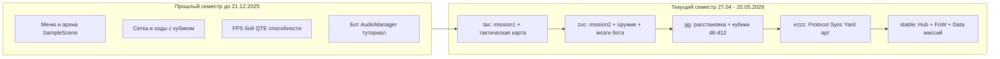

# Этапы прототипирования CyberGambit

**Репозиторий:** `c:\GitHub\CyberGambit`  
**Ветка:** `dev`  
**Финальная точка:** коммит `350c82d` — **stable** (20.05.2026, 14:25 +0300)

---

## О проекте

**CyberGambit** — однопользовательская тактическая игра в сеттинге киберпанка: пошаговые ходы с кубиком, тактическая карта, FPS-режим боя, миссии с целями. Референсы по тону: XCOM, Shadowrun.

> **Важно:** это **не шахматы**. В коде остались исторические имена (`ChessGrid`, `ChessRulesManager`, `ChessUnitType`) — это тактическая сетка и классы юнитов, а не шахматные правила. Геймплей: кубик → перемещение по сетке → тактический обзор → экшен-стрельба → QTE и способности.

**Платформа:** PC, 1920×1080, URP (`PC_RPAsset`).

---

## Хронология ветки `dev`

| № | Этап | Коммит | Дата | Сообщение | Семестр |
|---|------|--------|------|-----------|---------|
| 0 | Базовая линия | `342fb22` | 21.12.2025 | `bup` | Прошлый семестр (итог) |
| 1 | Тактика и миссия 1 | `c06d076` | 27.04.2026 | `tac` | Текущий |
| 2 | Миссия 2 и бой | `eb450ad` | 05.05.2026 | `zxc` | Текущий |
| 3 | Кубики и расстановка | `95f4edf` | 07.05.2026 | `gg` | Текущий |
| 4 | Окружение «Осады» | `3479a2b` | 08.05.2026 | `ezzz` | Текущий |
| 5 | Стабильный прототип | `350c82d` | 20.05.2026 | `stable` | Текущий |

*На 21.12.2025 было два коммита: `0468cd5 zxc` (утро) и `342fb22 bup` (день). Базой считается последний — `bup`.*

---

## Этап 0. Базовая линия — итог прошлого семестра

| | |
|---|---|
| **Коммит** | `342fb22078237148ba321f2c3f4f952ba7f7e952` |
| **Дата** | 21.12.2025, 14:48 (+0300) |
| **Сообщение** | `bup` |
| **Изменений в коммите** | 18 файлов, +12 626 / −573 строк |

### Цель этапа

Получить **играбельный вертикальный срез** в одной арене: меню → тактическая сцена → переключение в FPS → стрельба → бот → QTE и способности — без отдельных миссий, хаба и кампании.

### Что сделано в коммите `bup` (финальная доводка 21.12)

- Доработка `GameManager`, `Unit`, `QTESystem`, `QTEManager`, `TacticalModeUI`.
- Уточнение `CameraManager`, `BotController`, `ChessRulesManager`.
- Правки `WeaponCollider`, `UnitColorController`, `TutorialVideoManager`.
- Обновление сцен `MainMenu`, `SampleScene` и TMP-шрифтов.

### Итоговый результат этапа (состояние на `342fb22`)

| Область | Результат | Ключевые артефакты |
|---------|-----------|-------------------|
| **Сцены** | `MainMenu`, `SampleScene`, `Test` | Нет `mission1`, `mission2`, `HubBase` |
| **Ядро** | Ходы, кубик, PvP/PvBot, game over, пауза | `GameManager.cs` |
| **Сетка** | Координаты клеток, подсветка, проверка ходов по типу юнита | `ChessGrid.cs`, `ChessRulesManager.cs`, `GridHilghlighter.cs` |
| **Юнит** | FPS-движение, HP, привязка к сетке, классы юнитов | `Unit.cs` |
| **Камера** | Тактический режим ↔ экшен | `CameraManager.cs` |
| **Бой** | Стрельба, коллайдеры оружия | `WeaponCollider.cs`, префабы юнитов |
| **UI боя** | Панель экшен-режима | `ActionModeUI.cs`, `TacticalModeUI.cs` |
| **QTE** | Реакция на атаку врага (последовательность клавиш) | `QTESystem.cs`, `QTEManager.cs` |
| **Способности** | CD по ходам | `AbilitySystem.cs`, `UnitAbilities.cs`, `AbilityVisualEffects.cs` |
| **Бот** | Автоход противника | `BotController.cs` (добавлен в `0468cd5` утром того же дня) |
| **Меню** | Старт игры, настройки громкости | `MainMenu.cs`, `AudioManager.cs` |
| **Обучение** | Видео-туториал | `TutorialVideoManager.cs`, `tutorial.mp4` |
| **Контент** | Модели юнитов, анимации, оружие, арена | `Assets/Models/`, `Assets/Prefabs/`, `Assets/Animation/` |

### Критерии приёмки (этап 0)

- [ ] Запуск с `MainMenu` → загрузка `SampleScene`.
- [ ] Бросок кубика, ход по сетке, переключение в FPS.
- [ ] Стрельба по врагу, срабатывание QTE.
- [ ] Использование способности с откатом на следующий ход.
- [ ] Бот завершает свой ход без зависания.

### Внутренняя история прошлого семестра (коммиты до `bup`)

Ниже — что накопилось **до** базовой линии, по коммитам (для отчёта/портфолио).

#### `26f764a` — Initial commit (30.10.2025)

- Репозиторий: `.gitignore`, `.gitattributes`.
- **Результат:** пустой Git-проект.

#### `6061607` — dev (30.10.2025)

- Первый импорт Unity-проекта (~520 файлов).
- Модели юнитов (Pawn, Bishop, Horse, King, Queen, Guardian), арена, материалы.
- Базовые скрипты: `CameraManager`, `GameManager`, `Unit`.
- Сцена `SampleScene`, Input System, TextMesh Pro.
- **Результат:** серый прототип «ходи и смотри».

#### `78d7f34` — upd (17.11.2025)

- Главное меню: фон, кнопки, музыка `MainMenu.wav`.
- Новые FBX-модели, анимации idle/run, прицел.
- **Результат:** можно зайти через меню, улучшен визуал.

#### `21e8fb9` — upd models and anims (21.11.2025)

- Анимация атаки, обновление префабов юнитов.
- Чистка старых `*Unit.prefab`, доработка Input Actions.
- **Результат:** бой выглядит анимированно, не T-pose.

#### `f129981` — QoL upd (27.11.2025)

- `ChessGrid`, `ChessRulesManager`, `GridHilghlighter`.
- Оружие (мечи, PBR-текстуры), префаб `highlighter`.
- Доработка `CameraManager`, перестройка `SampleScene`.
- **Результат:** тактическая сетка и подсветка клеток работают.

#### `ced4f46` — add tutor (27.11.2025)

- Видео-туториал (`tutorial.mp4`), `TutorialVideoManager`, RenderTexture.
- **Результат:** онбординг для новых игроков.

#### `0ce2431` — qte&abilities (13.12.2025)

- `QTESystem`, `QTEManager`, `AbilitySystem`, `UnitAbilities`, `AbilityVisualEffects`.
- `ThreatZoneManager`, доработка `ActionModeUI`.
- **Результат:** реактивный бой и способности в игре.

#### `a55c35b` — zxc (17.12.2025)

- `AudioManager`, правки сцен и юнитов.
- **Результат:** единая точка звука UI/SFX.

#### `0468cd5` — zxc (21.12.2025, 12:41)

- **Первое появление** `BotController.cs`.
- Крупное обновление UI: `ActionModeUI`, `MainMenu`, `TacticalModeUI`.
- Правки `CameraManager`, `GameManager`, `Unit`, `ChessGrid`.
- 61 файл (+6 443 / −525).
- **Результат:** игра против бота и расширенный интерфейс боя.

#### `342fb22` — bup (21.12.2025, 14:48) ← **база этапа 0**

- См. блок «Что сделано в коммите `bup`» выше.

---

## Этап 1. Тактическая карта и миссия «Прорыв»

| | |
|---|---|
| **Коммит** | `c06d076854fd861febe391e0b4db17a5a5055aed` |
| **Дата** | 27.04.2026, 21:55 (+0300) |
| **Сообщение** | `tac` |
| **Масштаб** | 85 файлов, +27 844 / −2 233 строк |

### Цель этапа

Вынести геймплей из одной `SampleScene` в **отдельную миссию с целью** и дать игроку **тактическую мини-карту** с иконками юнитов.

### Что сделано в коммите

**Новые скрипты и логика миссии 1:**

- `Mission1CaptureManager` — победа при захвате трёх флагов.
- `Mission1FlagZone` — зоны контроля на карте.
- `Mission1BotObjectiveProvider` — приоритеты бота под захват.

**Тактический UI:**

- `TacticalMapUIController` — мини-карта.
- `TacticalMapUnitIcon` — иконки юнитов на карте.
- Доработка `TacticalModeUI`, `ActionModeUI`, `BotController`, `Unit`, `GameManager`.

**Сцены и окружение:**

- Новая сцена **`mission1.unity`** (+ NavMesh).
- Обновлены `MainMenu`, `SampleScene`, **`Test.unity`** (тестовая полигон).
- Окружение: трибуны, материалы, префаб `IconP1`, деревья/декор.

### Результат этапа

| Артефакт | Описание |
|----------|----------|
| Сцена `mission1` | Отдельный уровень «Прорыв» |
| Захват точек | Три флага, цикл проверки владения |
| Тактическая карта | Обзор поля и позиций в тактическом режиме |
| Бот миссии 1 | Поведение с учётом объективов (зачаток `Mission1BotBrain` в следующем этапе) |

### Критерии приёмки

- [ ] Загрузка `mission1` из редактора / Build Settings.
- [ ] На тактической карте видны союзники и враги.
- [ ] Захват трёх флагов завершает миссию победой.
- [ ] `Test` и `SampleScene` по-прежнему открываются без ошибок.

### Команда для просмотра diff

```bash
git show c06d076 --stat
```

---

## Этап 2. Миссия «Осада», оружие и мозги бота

| | |
|---|---|
| **Коммит** | `eb450adb2291ec1124a3e7c1a4cc9d2a3c115624` |
| **Дата** | 05.05.2026, 16:15 (+0300) |
| **Сообщение** | `zxc` |
| **Масштаб** | 146 файлов, +177 190 / −19 075 строк |

### Цель этапа

Добавить **вторую миссию**, полноценный **стрелковый бой**, **маркеры целей** на тактике и **миссионно-специфичный ИИ**.

### Что сделано в коммите

**Миссия 2:**

- Сцены **`mission2.unity`**, **`BaseScene.unity`**.
- `Mission2DestructionManager` — победа при уничтожении объектов.
- `DestructibleObjective` — разрушаемые цели.
- `TankController` — особая роль танка (таргетинг Guardian).
- `Mission2BotBrain` + интерфейс `IBotMissionBrain`.

**Миссия 1 (углубление):**

- `Mission1BotBrain`, `TacticalFlagMarker`, `TacticalFlagMarkersController`.

**Бой и презентация:**

- `Weapon.cs`, `RangedWeaponConfig` — дистанционное оружие.
- `TacticalUnitPresentation`, `TacticalWorldIconsController`, `TacticalWorldUnitIcon`.
- `BotTurnTacticalOverlay` — UI хода бота.

**Кубик (3D в UI):**

- Анимации кости: `Idle_dice`, `Spin`, `RifleRun`, `RifleShoot`, `End_1`…`End_6`.
- `Dice.controller`, префабы `dice8`, обновление `Dice6fbx`.

**Контент:**

- Массовые правки префабов юнитов, VFX-заготовки, skybox, UI-спрайты.

### Результат этапа

| Артефакт | Описание |
|----------|----------|
| Две миссии | `mission1` (захват) + `mission2` (уничтожение) |
| ИИ по миссиям | Отдельные «мозги» через `IBotMissionBrain` |
| Стрельба | Конфигурируемое дальнобойное оружие |
| 3D-кубик | Анимированная кость в интерфейсе хода |
| Тактические маркеры | Флаги и цели на мини-карте/мире |

### Критерии приёмки

- [ ] `mission2` загружается, NavMesh baked.
- [ ] Уничтожение всех `DestructibleObjective` → победа.
- [ ] Танк не выбирается обычным ботом как цель (логика ролей).
- [ ] Бросок кубика сопровождается 3D-анимацией.
- [ ] Маркеры миссии 1 отображаются на тактике.

---

## Этап 3. Расстановка армии, кубики и разведка

| | |
|---|---|
| **Коммит** | `95f4edff7d779541ee50f132cd6f982579eadf85` |
| **Дата** | 07.05.2026, 20:46 (+0300) |
| **Сообщение** | `gg` |
| **Масштаб** | 59 файлов, +5 314 / −197 строк |

### Цель этапа

Сделать **старт миссии осмысленным** (расстановка отряда за очки) и расширить **визуал кубика** и **информацию о враге**.

### Что сделано в коммите

**Расстановка (PvBot):**

- `ArmyDeploymentController` — бюджет очков, зона на сетке, drag-and-drop.
- `DeploymentCardUI`, `DeploymentPlacedUnitMarker`.
- Фаза деплоя в `GameManager` (интеграция с PvBot).

**Кубики:**

- Модели `dice6`, `dice8`, `dice10`, `dice12` + материалы и текстуры.
- Префабы `dice6`, `dice8`, `dice10`, `dice12`.
- `DiceRenderUI` — отрисовка кубика в UI тактики.

**Разведка:**

- `EnemyIntelTracker` — учёт видимости/знания о врагах (задел под туман войны).

**Прочее:**

- Стены `wall_10m`, `wall_corner` для уровней.
- Доработка ботов миссий, `TacticalMapUIController`, `Unit`, сцены `mission1`/`mission2`.

### Результат этапа

| Артефакт | Описание |
|----------|----------|
| Pre-battle | Экран расстановки с карточками юнитов |
| Кубики d6–d12 | Разные модели для визуала/геймдизайна |
| Intel | Трекер данных о противнике |
| PvBot-цикл | Расстановка → кубик → ход |

### Критерии приёмки

- [ ] В PvBot перед боем открывается панель расстановки.
- [ ] Нельзя подтвердить армию с превышением бюджета.
- [ ] Юниты появляются только в зоне деплоя.
- [ ] `DiceRenderUI` показывает результат броска.
- [ ] `EnemyIntelTracker` не падает при отсутствии врагов.

---

## Этап 4. Окружение Protocol Sync Yard и полировка миссии 2

| | |
|---|---|
| **Коммит** | `3479a2b19b63bfa7d1f8a0c791d96a4608037087` |
| **Дата** | 08.05.2026, 17:15 (+0300) |
| **Сообщение** | `ezzz` |
| **Масштаб** | 372 файла, крупный импорт ассетов и анимаций |

### Цель этапа

Превратить `mission2` из «серой карты» в **читаемый киберпанк-двор** с промышленными объектами, VFX и анимациями стрельбы.

### Что сделано в коммите

**Окружение Protocol Sync Yard:**

- GLB/префабы: контейнеры, заборы, генераторы, Sync Core, стены, дороги, рампы, прожекторы и др. (`Assets/Prefabs/Mission2Models/`).
- Сцены **`ProtocolSyncYard.unity`**, **`oldmission2.unity`**, пересборка **`mission2.unity`**.
- Материалы `ProtocolSyncYard`, спрайт-листы ассетов.

**Анимации и VFX:**

- `Bishop_Run_Constant`, `Bishop_Shoot_Rifle`, доработка `BishopShoot`, `RifleRun 1`.
- `HandIKController`, `CameraShake`, трассеры/взрывы (`Assets/VFX/`).
- AI Toolkit — референс-изображения для генерации ассетов.

**Геймплей (доработка):**

- Уточнение `Mission2BotBrain`, `DestructibleObjective`, `TankController`.
- `AbilitySystem`, `ArmyDeploymentController`, тактические контроллеры.

### Результат этапа

| Артефакт | Описание |
|----------|----------|
| Визуал миссии 2 | Полноценный промышленный двор |
| Каталог префабов | Переиспользуемые блоки уровня |
| Боевой фидбек | IK рук, тряска камеры, VFX выстрелов |
| Черновик карты | `ProtocolSyncYard` для итераций layout |

### Критерии приёмки

- [ ] `mission2` собирается без missing prefab/material.
- [ ] NavMesh покрывает проходимые зоны после расстановки объектов.
- [ ] Анимации стрельбы/бега проигрываются в экшен-режиме.
- [ ] VFX выстрела и взрыва видны в сцене.

---

## Этап 5. Стабильный прототип — хаб, туман войны, кампания

| | |
|---|---|
| **Коммит** | `350c82d648f83d1712d1cee159ae3ecf6f1ff03a` |
| **Дата** | 20.05.2026, 14:25 (+0300) |
| **Сообщение** | `stable` |
| **Масштаб** | 331 файл, +187 788 / −39 929 строк |

### Цель этапа

Собрать **демо-версию**: меню → хаб → выбор миссии → бой с туманом войны, квестами и стабильными переходами между сценами.

### Что сделано в коммите

**Хаб (мета-слой):**

- Сцена **`HubBase.unity`** (+ NavMesh).
- `HubSceneBootstrap` — инициализация FPS-режима в базе.
- `HubComputerTerminal`, `HubInteractionHintUI` — терминал [E].
- `MissionSelectUI`, `MissionDefinition` — каталог миссий «Прорыв» / «Осада».
- Модель `SciFiComputer`, планы: `Assets/Plans/hub-*.md`, `mission-select-ui.md`.
- `MainMenu.PlayGame()` → загрузка `HubBase`.

**Туман войны:**

- Пакет `Assets/Scripts/FogOfWar/` (`FogOfWarManager`, overlay, vision stamper, unit visibility, intel).
- Шейдеры `FogOfWarOverlay`, `FogOfWarAction`, `FogOfWarCommon.hlsl`.
- Данные: `FOWMission2.asset`, `DefaultFogOfWarSettings`, `Mission2FogOfWarSettings`.

**Миссии и квесты:**

- `Assets/Data/Missions/Mission1.asset`, `Mission2.asset` (ScriptableObject).
- `MissionObjectivesConfig`, `MissionQuestUI`, квест-ассеты.
- `Mission2DefenseTerminal`, `Mission2ObjectiveShield`, `TacticalMission2MarkersController`.
- `MissionObjectivesEditorMenu` (Editor).
- Полировка `Mission1CaptureManager`, ботов, `QTESystem`.

**UI и деплой:**

- `DeploymentUnitInfoPanelUI`, доработка армии и тактики.
- Превью миссий (`mission1.png`, `mission2.png`).
- Анимации смерти/прицеливания Bishop (`BishopDeath`, `BishopAiming`, `BishopRun.001`).

**Сцены:**

- Финальная сборка `mission1`, `mission2`, `MainMenu`, `HubBase`, `BaseScene`.

### Результат этапа (текущее состояние `dev`)

| Поток | Маршрут |
|-------|---------|
| Старт | `MainMenu` → **Play** → `HubBase` |
| Выбор миссии | Терминал [E] → «Прорыв» (`mission1`) / «Осада» (`mission2`) |
| Миссия 1 | Расстановка → захват 3 флагов → квесты в HUD |
| Миссия 2 | Расстановка → взлом/щит/уничтожение → FoW |
| Пауза | Esc, громкость, выход в меню (хаб и миссии) |

### Полный список сцен на `stable`

| Сцена | Назначение |
|-------|------------|
| `MainMenu` | Точка входа |
| `HubBase` | FPS-база, выбор миссий |
| `mission1` | Миссия «Прорыв» |
| `mission2` | Миссия «Осада» |
| `SampleScene` | Песочница / legacy-тест |
| `Test` | Тестовый полигон |
| `BaseScene` | Базовая заготовка |
| `ProtocolSyncYard` | Редакторский layout двора |
| `oldmission2` | Старая версия карты |

### Критерии приёмки (финальный прототип)

- [ ] `MainMenu` → `HubBase` без ошибок в консоли.
- [ ] У терминала: подсказка [E], UI миссий, загрузка выбранной сцены.
- [ ] `mission1`: расстановка → флаги → победа, квесты обновляются.
- [ ] `mission2`: туман войны, цели, танк/терминал, победа по объективам.
- [ ] QTE и способности работают в экшен-режиме.
- [ ] Пауза и настройки звука сохраняются в сессии.
- [ ] Все сцены из таблицы добавлены в **Build Settings**.

### Команды Git

```bash
# Текущая стабильная точка
git checkout dev
git log -1 --oneline

# Сравнить с базой прошлого семестра
git diff 342fb22..350c82d --stat

# Откатиться на базу 21.12.2025 (только для сравнения)
git checkout 342fb22
```

---

## Сводка: что добавил каждый семестр



| Семестр | Коммиты | Главный итог |
|---------|---------|--------------|
| Прошлый (→ 21.12.2025) | `26f764a` … `342fb22` | Играбельная арена: сетка, кубик, FPS, QTE, бот, меню |
| Текущий (→ 20.05.2026) | `c06d076` … `350c82d` | Две миссии, хаб, FoW, расстановка, визуал, stable build |

---

## Что намеренно вне scope прототипа `stable`

- Онлайн-мультиплеер.
- Сохранение кампании / прогресс между сессиями.
- Больше двух миссий в каталоге (есть задел `MissionDefinition`).
- Полная локализация EN.
- Продакшен-баланс и туториал внутри миссий 1–2.

---

## Test plan (сквозной прогон на `350c82d`)

1. Открыть проект Unity, ветка `dev`, коммит `stable`.
2. **File → Build Settings:** `MainMenu`, `HubBase`, `mission1`, `mission2` в списке сцен.
3. Play с `MainMenu` → Play → в хабе подойти к компьютеру → [E].
4. Выбрать **«Прорыв»** → расстановить армию → Confirm → захватить 3 флага.
5. Вернуться в хаб (меню или перезапуск) → **«Осада»** → пройти объективы с туманом войны.
6. Проверить QTE при атаке врага, способность одного класса, паузу Esc.

---

*Документ сгенерирован по истории Git ветки `dev`. При новых коммитах обновляйте таблицу хронологии и добавляйте этап N+1 по шаблону этапов 1–5.*
